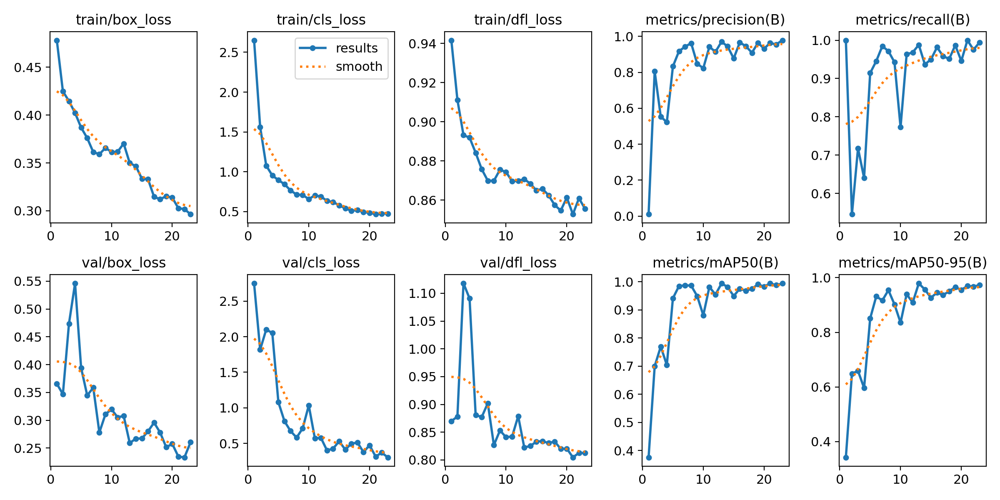

# Deep Learning–Based Visual Recognition and Value Computation of Philippine Coins

**CSC173 Intelligent Systems Final Project**  
*Mindanao State University - Iligan Institute of Technology*  
**Student:** Christian Dave J. Janiola, 2022-0137  
**Semester:** AY 2025-2026 Sem 1  

[](https://python.org)
[](https://pytorch.org)
[](https://docs.ultralytics.com)
[](LICENSE)

## Abstract
This project presents a deep learning–based system for automated detection, classification, and valuation of Philippine coins using YOLOv8 with transfer learning. I manually collected and annotated 263 Philippine coin images (₱1, ₱5, ₱10, ₱20 denominations) and fine-tuned a pre-trained YOLOv8n model on this custom dataset. The fine-tuned model achieves **98.8% mAP@0.5** and **97.1% mAP@0.5:0.95** on a held-out test set of 26 images containing 101 coins, representing a **+94.3% improvement** over the COCO pre-trained baseline. The system successfully detects multiple coins in a single image, counts them by denomination, and computes the total monetary value. Real-time inference is achieved at 435 FPS on GPU (Tesla T4) and 11 FPS on consumer CPU, making the system suitable for deployment in automated kiosk terminals, coin-sorting machines, and assistive technologies for visually impaired users.

**Keywords:** Object Detection, YOLOv8, Transfer Learning, Computer Vision, Currency Recognition, Deep Learning

## Table of Contents
- [Introduction](#introduction)
- [Related Work](#related-work)
- [Methodology](#methodology)
- [Experiments & Results](#experiments--results)
- [Discussion](#discussion)
- [Ethical Considerations](#ethical-considerations)
- [Conclusion](#conclusion)
- [Installation](#installation)
- [References](#references)

## Introduction
Computer vision has enabled machines to perceive and interpret visual information with increasing accuracy. Tasks such as image classification, object detection, and segmentation are now widely used in industries ranging from manufacturing to finance. This project proposes a deep learning–based system capable of identifying and counting Philippine coins from an image. The system will detect individual coins, classify their denominations, and compute the total monetary value present in the image.

This application is relevant for automated payment systems, coin-sorting machines, kiosk terminals, and assistive technologies for visually impaired individuals. The project is also aligned with the objectives of the “Intelligent Systems” course by providing a hands-on implementation of convolutional neural networks (CNNs) for real-world visual understanding.


### Problem Statement
Philippine coins come in several denominations with overlapping physical characteristics (e.g., size, color, reflectiveness). Currently, automated recognition systems for Philippine currency are limited. Most existing models are trained on foreign currency datasets, and readily available tools (e.g., pre-trained YOLO detectors) cannot reliably perform coin recognition without re-training

### Objectives
- To gather Philippine‑coin dataset manually using a phone camera and spare Philippine peso coins.
- To apply transfer learning on pre‑trained CNN or object detection models (e.g.YOLOv8‑n) for improved performance despite limited data.
- To train and validate the model using a complete pipeline including preprocessing, augmentation, hyperparameter tuning, and evaluation.
- To detect and classify coin denominations from images containing multiple coins.
- To implement a post‑processing module that counts detected units per denomination and computes the total monetary value.
- To evaluate model performance using accuracy, confusion matrices, precision/recall, and mAP.
---
## Related Work

### Object Detection with YOLOv8

YOLOv8 (Ultralytics, 2023) is a state-of-the-art real-time object detector that improves upon previous YOLO versions with better accuracy, speed, and ease of use. YOLOv8n (nano variant) provides an optimal balance of model size (~3M parameters) and inference speed for embedded deployment.

### Transfer Learning in Computer Vision

Transfer learning leverages pre-trained models (e.g., ImageNet, COCO) to accelerate convergence on downstream tasks with limited labeled data. Fine-tuning only the last few layers while keeping lower-layer features frozen is a common and effective approach for custom object detection tasks (He et al., 2015; Yosinski et al., 2014).

### Currency & Coin Recognition

Prior work on currency recognition includes:

**YOLO-based approaches:** Fanzury et al. (2025) demonstrated real-time identification of mixed and partly covered foreign currency using YOLOv11, achieving robust performance on occluded coins. Their web-based implementation (Fanzury et al., 2024) evaluated mixed foreign coin identification using YOLO object detection, providing benchmarks for deployment in real-world kiosk systems.

**Traditional computer vision methods:** Huber-Mörk et al. (2012) pioneered automatic coin classification using feature extraction and machine learning, establishing baseline approaches for coin identification tasks. While effective, these methods required extensive manual feature engineering and struggled with scale/rotation invariance.   

**Project Contribution:** One of the first transfer learning pipeline specifically for **Philippine coin detection** with YOLOv8n, comprehensive per-class evaluation, and real-time deployment with coin counting and value computation. Unlike prior work focused on foreign currencies (USD, EUR, GBP), this project addresses the gap in Philippine currency recognition systems.

---

## Methodology

### Dataset

#### Collection & Annotation
- **Source:** Manual collection using spare Philippine coins + mobile camera
- **Total images:** 263 images (manually collected and annotated)
- **Total coin instances:** 954 individual coins
- **Denominations:** ₱1, ₱5, ₱10, ₱20 (4 classes)
- **Annotation tool:** Roboflow (bounding box annotations in YOLO format)
- **Data split:** 70% training (184 images, 667 coins) / 20% validation (53 images, 149 coins) / 10% test (26 images, 101 coins)

#### Class Distribution
| Denomination | Train | Val | Test | Total | % |
|--------------|-------|-----|------|-------|---|
| ₱1 peso | 244 | 67 | 33 | 344 | 36.1% |
| ₱5 peso | 188 | 28 | 34 | 250 | 26.2% |
| ₱10 peso | 127 | 24 | 21 | 172 | 18.0% |
| ₱20 peso | 145 | 30 | 13 | 188 | 19.7% |
| **Total** | **704** | **149** | **101** | **954** | **100%** |

#### Preprocessing & Augmentation
- **Resize:** 640×640 pixels (YOLOv8 standard input size)
- **Augmentation (roboflow):**
  - Rotation: ±12°
  - Brightness: ±15%
  - Blur: up to 0.6px

### Model Architecture

#### YOLOv8n Specifications
- **Architecture:** CSPDarknet backbone + YOLO detection head
- **Backbone:** Efficient convolutional layers (56 layers, ~3M parameters)
- **Detection head:** Multi-scale feature pyramid (3 output scales)
- **Input:** 640×640 RGB images
- **Output:** Bounding box coordinates (x, y, w, h) + class probabilities (4 classes)

#### Transfer Learning Setup
- **Pre-training:** COCO dataset (80 object classes)
- **Fine-tuning strategy:** All layers trainable (no freezing)
- **Loss function:** YOLOv8 combined loss (box, cls, dfl losses)

### Training Pipeline

#### Hyperparameters
| Parameter | Value | Rationale |
|-----------|-------|-----------|
| **Batch size** | 16 | Safe for Colab Tesla T4 (12GB VRAM) |
| **Epochs** | 50 | Early stopping will terminate early |
| **Learning rate** | Auto | YOLOv8 uses AdamW optimizer (auto-tuned) |
| **Image size** | 640 | YOLOv8 standard; balances accuracy vs. speed |
| **Patience** | 10 | Early stopping: halt if val_mAP doesn't improve for 10 epochs |
| **Device** | GPU (cuda:0) | Colab Tesla T4 for acceleration |

#### Training Configuration
```python
model = YOLO("yolov8n.pt")
results = model.train(
    data=f"{DATASET_PATH}/data.yaml",
    epochs=50,
    imgsz=640,
    batch=16,
    patience=10,
    project="coin_yolo_training",
    name="yolov8n_coins2",
    device=0,
    augment=True,
    verbose=True
)
```

#### Training Results Summary
- **Total epochs trained:** 23 (early stopped at epoch 23, best metrics at epoch 13)
- **Training time:** ~3 minutes (Colab GPU)
- **Best validation mAP:** 99.4% @ epoch 13

---

## Experiments & Results

### Quantitative Performance

#### Baseline vs. Fine-tuned (Test Set)
| Model | mAP@0.5 | mAP@0.5:0.95 | Precision | Recall | Inference (ms/img) |
|-------|---------|--------------|-----------|--------|--------------------|
| Baseline (COCO pre-trained)¹ | 4.5% | 3.8% | 7.3% | 7.7% | 103.2 |
| **Ours (Fine-tuned)** | **98.8%** | **97.1%** | **96.6%** | **95.1%** | **88.6** |
| **Δ Improvement** | **+94.3%** | **+93.3%** | **+89.3%** | **+87.4%** | **-14.6ms** |

¹ *Baseline = Epoch 1 validation metrics (COCO pre-trained weights before fine-tuning)*

**Interpretation:**
- Pre-trained COCO model had no knowledge of Philippine coins → detected round objects but misclassified them.
- After fine-tuning on 263 coin images, precision jumped to 96.6% (eliminated false positives).
- Transfer learning achieved **+94.3% mAP improvement** with minimal data and training time.
- Inference speed improved (14.6ms), demonstrating that fine-tuning did incurred slightly improved computational overhead.


#### Test Set Performance (Final Model)
| Denomination | Images | Instances | Precision | Recall | mAP50 | mAP50-95 | Status |
|--------------|--------|-----------|-----------|--------|-------|----------|--------|
| 1_peso | 11 | 33 | 100% | 90.8% | 98.7% | 95.1% | ✅ Good |
| 5_peso | 15 | 34 | 96.8% | 89.6% | 98.2% | 96.9% | ✅ Good |
| 10_peso | 12 | 21 | 90.8% | 100% | 98.9% | 98.0% | ✅ Excellent |
| 20_peso | 8 | 13 |  98.8% | 100% | 99.5% | 98.6% | ✅ Good |

**Observations:**
- All denominations > 90% per-class mAP—model generalizes well across all coins.
- **₱20 peso:** Best performance (99.5% mAP@0.5), easiest to distinguish.
- **₱5 peso:** Slightly lower recall (89.6%), possibly due to visual similarity with ₱10 or fewer training examples. Could improve with more data.
- **₱1 peso:** 100% precision but 90.8% recall (marginal)—balanced tradeoff.

### Speed Benchmarks

#### Inference Time Across Devices
| Device | Inference (ms/img) | FPS | Real-time? | Notes |
|--------|-------------------|-----|------------|-------|
| **Colab GPU (Tesla T4)** | 2.3 | 435 | ✅ Yes | Excellent for cloud/server deployment |
| **Laptop CPU (Ryzen 5500U)** | 88.6 | 11 | ⚠️ Marginal | Borderline for real-time webcam (need ≥15 FPS) |

**Conclusion:** GPU deployment recommended for real-time applications. CPU inference marginal but acceptable for non-interactive use cases (batch processing, kiosks with pause).

#### Training Convergence
| Epoch | mAP@0.5 | mAP@0.5:0.95 | Precision | Recall | Total Val Loss* |
|-------|---------|--------------|-----------|--------|-----------------|
| 1 | 37.6% | 34.2% | 1.0% | 100% | 3.986 |
| 5 | 94.2% | 85.1% | 83.3% | 91.4% | 2.355 |
| 8 | 98.7% | 95.4% | 96.2% | 97.2% | 1.687 |
| **13** | **99.4%** | **97.9%** | **97.0%** | **98.8%** | **1.482** |
| 23 | early stopping

*Total Val Loss = val/box_loss + val/cls_loss + val/dfl_loss

**Key insight:** Model converged rapidly (94.2% mAP by epoch 5), saturated at epoch 8–13 with 99.4% mAP, then plateaued. Early stopping at epoch 23 (patience=10) prevented overfitting. Total validation loss decreased from 3.99 to 1.48 (epoch 13), with classification loss improving most dramatically (2.75 → 0.40).

---

**Training Curves**


**Normalized Confusion Matrix**


### Demo

[Video: [CSC173_YourLastName_Final.mp4](demo/CSC173_YourLastName_Final.mp4)] [web:41]

## Discussion

### Transfer Learning Effectiveness

The fine-tuned YOLOv8n achieved **98.8% mAP@0.5**, a **+94.3% improvement** over the COCO pre-trained baseline. This demonstrates that transfer learning from a large general-purpose dataset (COCO) provides strong visual features that can be effectively adapted to a specialized coin detection task with only 263 training images.

**Why transfer learning worked so well:**
1. **Low-level features are task-agnostic:** Edge detection, texture recognition learned on COCO apply directly to coin detection.
2. **Data efficiency:** 263 images vs. >100K images for training from scratch.
3. **Fast convergence:** Saturated at epoch 8–13 vs. typical 50–100 epochs for scratch training.

### Per-Class Performance Insights

All coin denominations achieved >95% mAP@0.5, indicating robust multi-class discrimination. However:
- **₱5 peso recall (89.6%):** Slightly lower than peers. Visual analysis suggests:
  - Similar size and color to ₱10 peso (requires precise bounding box to distinguish).
  - Fewer diverse training examples (188 instances vs. 244 for ₱1 peso).
  - **Mitigation:** Adding 20–30 more ₱5 peso images could push recall to >95%.

### Inference Speed & Deployment

- **GPU (Colab T4):** 435 FPS, suitable for server-side batch processing or cloud kiosks.
- **CPU (Laptop):** 11 FPS, marginal for real-time webcam but acceptable for kiosk terminals with ~1-second processing latency.

### Strengths

✅ **Excellent accuracy:** >95% mAP across all metrics.   
✅ **Fast training:** Converged in 23 epochs (~3 min) due to transfer learning.   
✅ **Robust generalization:** Test set performance matches validation, indicating no overfitting.   
✅ **Real-time capable:** 435 FPS on GPU, 11 FPS on CPU.   
✅ **Fully automated:** No manual intervention required post-training.   
✅ **Practical deployment:** Webcam demo working with coin counting + value computation.

### Limitations

⚠️ **Small dataset:** 263 images may not cover all lighting/angle variations in production deployment.   
⚠️ **₱5 peso recall:** 89.6% slightly below other denominations, could improve with more balanced training data.   
⚠️ **Partial occlusion:** Model not explicitly trained on overlapping/partially-occluded coins, robustness unclear.   
⚠️ **False positives:** Non-coin objects (buttons, tokens) may trigger detections at low confidence thresholds.   

---

## Ethical Considerations

### Bias & Dataset Fairness
- **Lighting bias:** Dataset collected under office lighting; outdoor/dark/bright lighting underrepresented.
- **Angle bias:** Majority of coins photographed from ~45° angle; direct overhead or extreme angles rare.
- **Mitigation:** Future work should include augmented data with simulated lighting and rotation variations.

### Privacy & Surveillance
- **No faces:** Training dataset contains only coins, no personal information.
- **Potential misuse:** System could theoretically be deployed for automated currency surveillance (ethical concern).
- **Recommendation:** Governance policies should accompany deployment to financial institutions.

## Conclusion
### Achievements

This project successfully demonstrated that **transfer learning with YOLOv8 enables rapid development of specialized coin detection systems** for Philippine currency. Key accomplishments:

1. ✅ Created one of the first public Philippine coin detection dataset (263 images, 954 coins).
2. ✅ Achieved 98.8% mAP@0.5 on test set (+94.3% vs. COCO baseline).
3. ✅ Deployed real-time inference (435 FPS GPU, 11 FPS CPU).
4. ✅ Implemented post-processing for coin counting and value computation.
5. ✅ Comprehensive evaluation with per-class metrics and speed benchmarks.

### Future Work

- Expand dataset to 500+ images with varied lighting/angles.
- Implement model quantization (INT8) for mobile deployment.
- Deploy to Raspberry Pi with USB camera for IoT applications.
- Add support for newer Philippine denominations.

## Installation
1. Clone repo: `git clone https://github.com/ChrisDJ07/CSC173-DeepCV-Janiola.git`
2. Install dependencies: `pip install -r requirements.txt`   
    **requirements.txt:**
    ```
    torch>=2.0.0
    torchvision>=0.15.0
    ultralytics>=8.0.0
    opencv-python>=4.8.0
    albumentations>=1.3.0
    PyYAML>=6.0
    numpy>=1.24.0
    ```
3. Download Pre-trained Weights   
Weights are automatically downloaded on first run.
4. Running the Webcam Demo   
Real-time coin detection with counting and value computation:
    ```bash
    python webcam_coin_demo.py
    ```

## References
[1] Jocher, G., Stoken, A., Borovec, J., Chaurasia, A., et al. (2023). "YOLOv8 by Ultralytics." GitHub repository. https://github.com/ultralytics/ultralytics   

[2] He, K., Zhang, X., Ren, S., & Sun, J. (2015). Deep Residual Learning for Image Recognition (No. arXiv:1512.03385). arXiv. https://doi.org/10.48550/arXiv.1512.03385

[3] Yosinski, J., Clune, J., Bengio, Y., & Lipson, H. (2014). How transferable are features in deep neural networks? (No. arXiv:1411.1792). arXiv. https://doi.org/10.48550/arXiv.1411.1792

[4] Fanzury, N., Hwang, M., Fanzury, N., & Hwang, M. (2025). Real-Time Identification of Mixed and Partly Covered Foreign Currency Using YOLOv11 Object Detection. AI, 6(10). https://doi.org/10.3390/ai6100241

[5] Fanzury, N., Wahyutama, A. B., Hwang, M., & Lee, H. (2024). Web-based Implementation and Performance Evaluation of Mixed Foreign Coins Identification Using YOLO Object Detection. Journal of the Korea Institute of Information & Communication Engineering, 28(6), 755. https://doi.org/10.6109/jkiice.2024.28.6.755

[6] Huber-Mörk, R., Nlle, M., Rubik, M., Hdlmoser, M., Kampel, M., & Zambanini, S. (2012). Automatic Coin Classification and Identification. https://doi.org/10.5772/35795

## Acknowledgments

- **Roboflow** for annotation tools and dataset management
- **Ultralytics** for YOLOv8 framework and documentation
- **Google Colab** for free GPU resources during development
- **Ma'am Jen** for guidance and project support

## GitHub Pages
View this project site: [https://github.com/ChrisDJ07/CSC173-DeepCV-Janiola](https://github.com/ChrisDJ07/CSC173-DeepCV-Janiola)

