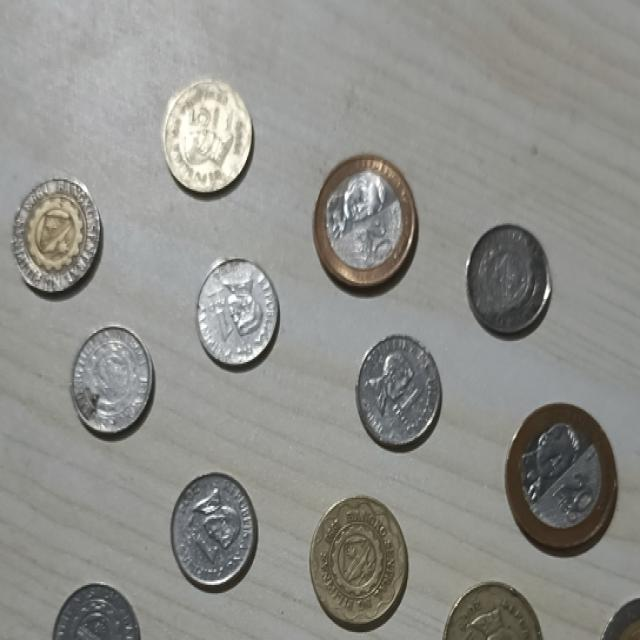

# CSC173 Deep Computer Vision Project Progress Report
**Student:** Christian Dave J. Janiola, 2022-0137  
**Date:** December 13, 2025  
**Repository:** [https://github.com/ChrisDJ07/CSC173-DeepCV-Janiola](https://github.com/ChrisDJ07/CSC173-DeepCV-Janiola)

## 📊 Current Status
| Milestone | Status | Notes |
|-----------|--------|-------|
| Dataset Preparation | ✅ Completed | 263 images manually gathered, annotate, and preprocessed |
| Initial Training | ✅ In Progress | 23 epochs completed |
| Baseline Evaluation | ⏳ Pending | Training ongoing |
| Model Fine-tuning | ⏳ Not Started | Planned for tomorrow |

## 1. Dataset Progress
- **Total images:** 263
- **Train/Val/Test split:** 70%/20%/10%
- **Classes implemented:** 1 class: coin (1_peso, 5_peso, 10_peso, 20_peso)
- **Preprocessing applied:** Resize(640), augmentation (rotate +-12°, brightness +-15%, blur up to 0.6px)

**Sample data preview:**

## 2. Training Progress

**Training Curves (so far)**

**Current Metrics:**
| Metric | Train | Val |
|--------|-------|-----|
| Loss | [0.45] | [0.62] |
| mAP@0.5 | [78%] | [72%] |
| Precision | [0.81] | [0.75] |
| Recall | [0.73] | [0.68] |

## 3. Challenges Encountered & Solutions
| Issue | Status | Resolution |
|-------|--------|------------|
| CUDA out of memory | ✅ Fixed | Reduced batch_size from 32→16 |
| Class imbalance | ⏳ Ongoing | Added class weights to loss function |
| Slow validation | ⏳ Planned | Implement early stopping |

## 4. Next Steps (Before Final Submission)
- [ ] Complete training (50 more epochs)
- [ ] Hyperparameter tuning (learning rate, augmentations)
- [ ] Baseline comparison (vs. original pre-trained model)
- [ ] Record 5-min demo video
- [ ] Write complete README.md with results
